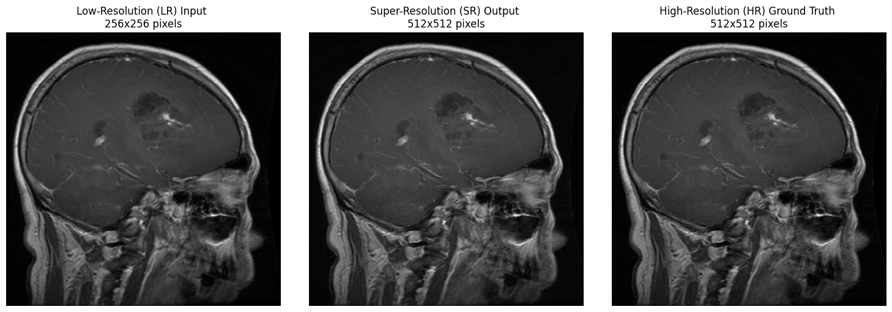
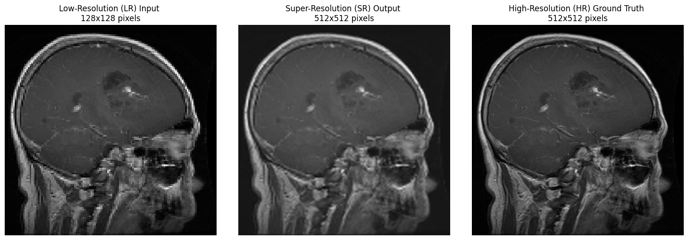

# Super Resolution Vision Transformer (SRViT)

## Abstract
This research presents a novel approach to Image Super-Resolution (ISR) using a Low-to-High Multi-Level Transformer (LMLT), aimed at improving the quality of medical images, specifically brain MRI scans. Traditional methods and early deep learning models, such as SRCNN, suffer from limitations in capturing fine textures and global dependencies. To address this, the proposed LMLT model integrates hierarchical self-attention mechanisms and multi-level feature aggregation to enhance image resolution while preserving both local details and broader context. A dataset comprising 1596 MRI images across various tumor types was preprocessed and used to train the model. The LMLT architecture was evaluated against state-of-the-art models, including SRCNN and SwinIR, using PSNR and SSIM as performance metrics. Results show that LMLT significantly outperforms existing models, achieving a PSNR of 46.73 and an SSIM of 0.9948. These findings demonstrate the effectiveness of LMLT in medical image enhancement and support its potential for improving diagnostic precision in healthcare applications.

## Introduction
Image Super-Resolution (ISR) is a computer vision technique used to reconstruct high-resolution images from low-resolution inputs. The process refines fine details and visual quality, and it is therefore crucial in applications such as medical imaging, satellite image processing, and security surveillance.Conventional image improvement techniques like interpolation tend to perform poorly in restoring the fine details that are lost in images with low resolutions, leading to poor accuracy and quality. Deep learning-based models, particularly Convolutional Neural Networks (CNNs), have indicated a lot of promise in overcoming these limitations, providing improved results in increasing image resolution. Nevertheless, regardless of the achievements of these approaches, conventional CNNs such as SRCNN tend to lack the ability to capture the global context and finer textures, resulting in less optimal results in more intricate image features.
The introduction of Vision Transformers (ViTs) has brought new avenues in the field of computer vision, where self-attention can be used to handle long-range dependencies and express complex structures of images. SwinIR employs the Swin Transformer model, improving image resolution using hierarchical feature learning and attention. The model has proved to be effective in addressing CNN model limitations through the efficient capture of local and global features.
Based on these developments, a new model called the Low-to-High Multi-Level Transformer (LMLT) is suggested. LMLT combines transformers and multi-level feature combination to enhance the accuracy and quality of super-resolved images. LMLT, through its use of the self-attention mechanism, can pay attention to areas in the image that are relevant, regardless of their spatial location, enhancing the visual quality and retaining salient image features.

## Results
LMLT x2 Upscaling


LMLT x4 Upscaling


## Features

- Utilizes Vision Transformer (ViT) for image super-resolution
- Supports multiple upscaling factors (e.g., 2x, 4x)
- Modular and extensible codebase
- Training and evaluation notebooks included
- Compatible with popular datasets (e.g., DIV2K, Set5)

## Installation

1. Clone the repository:
    ```bash
    git clone https://github.com/mkkhan151/SRViT-FYP.git
    cd SRViT-FYP
    ```

2. Create and activate a virtual environment (Recommended):
    ```bash
    python -m venv .venv
    # On Windows
    .venv\Scripts\activate
    # On macOS/Linux
    source .venv/bin/activate
    ```

3. Install dependencies:
    ```bash
    pip install -r requirements.txt
    ```

## Usage

### Training
- For Training, visit [SRViT_Training_x2](notebooks/SRViT_Training_x2.ipynb) in notebooks folder.
- It contains all code data loading, model architecture, training, and evaluation.

### Evaluation
- visit the [SRViT_Training_x2](notebooks/SRViT_Training_x2.ipynb) for detailed instructions.

### Streamlit App
- To test the model, run streamlit app after creating virtual environment.
  ```bash
  streamlit run app.py
  ```
